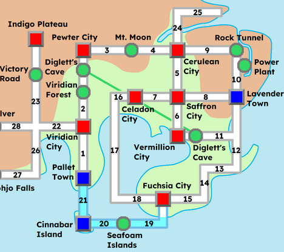

# 

**Número da Lista**: 52 
**Conteúdo da Disciplina**: Grafos 

## Alunos  
| Matrícula | Nome |  
|-----------------------|---------------------|  
| 180075462 | [Gabriel Freitas Balbino](https://github.com/gabrielfreitass1) |  

## Descrição do projeto
Este projeto tem como objetivo aprofundar o conhecimento sobre Grafos utilizando o algoritmo de Dijkstra em um mapa da regiao de Kanto do jogo Pokemon. No jogo as cidades e outros locais(nos) sao conectadas atraves das rotas(arestas) os custos das conecçoes serao dadas por:

| Tipo de caminho        | Peso     |
| ---------------------- | -------- |
| Rota simples           | 1–3      |
| Caverna/Floresta       | 4–6      |
| Água (surf)            | 5–7      |
| Caminho com obstáculos | +2 extra |

O mapa que esta sendo usado de referencia:
  
Outros mapas que foram usados como referencia podem ser encontrados em:
[Outros Mapas](./img/)

## Screenshots 
  

## Instalação 
**Linguagem**: Python 

### Execute a Solução
- Basta entrar na pasta src e compilar o arquivo main.py
- Caso queira ver a versao com frontend execute um python -m http.server                                                                                  

### Link da apresentação
[Vídeo](https://youtu.be/6kQXqLaqxgc) 

